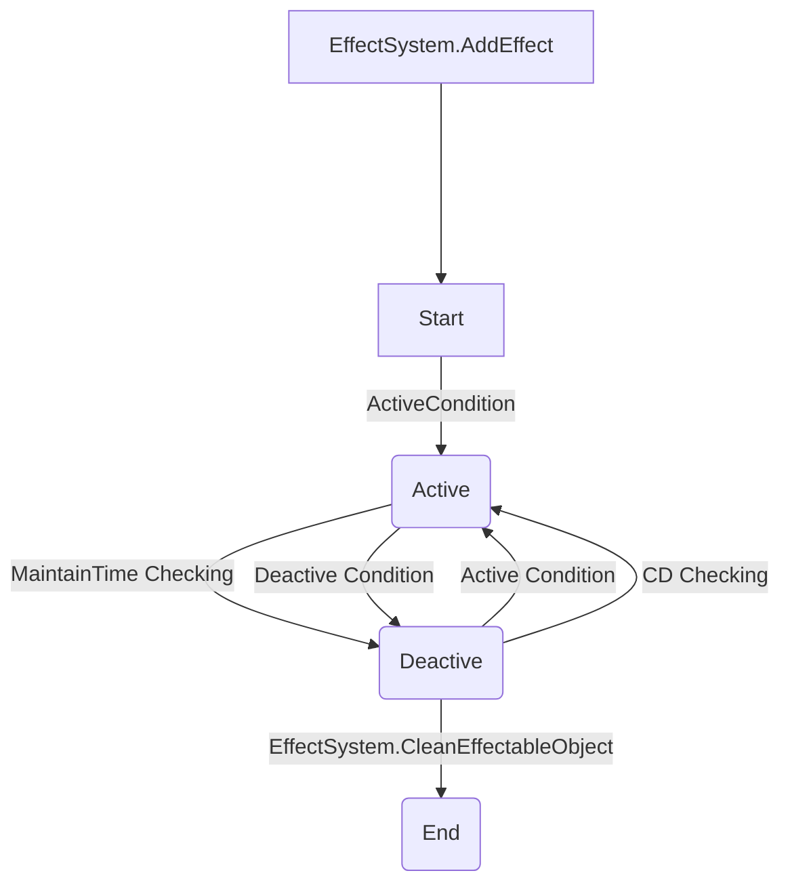

See [Document](https://macacagames.github.io/EffectSystem/) for more detail.

# Overview
Effect System is a powerful numerical calculator based on EffectType. It possesses high flexibility, maintainable states, the ability to implement custom logic, trigger conditions, and visual management. It can achieve the following example functionalities:

- Increase ATK by 50 points.
- Increase HP by 10%.
- Boost DEF by 5% for 50 seconds.
- Reduce the ATK of a specified enemy by 100, usable once every 30 seconds.
- When successfully blocking, decrease the opponent's DEF by 50%.

The table is used to collage various buffs, debuffs or skill effects based on EffectInfo as the basic unit, and it's convenient to use between different projects. Engineers only need to implement EffectType and register the timing of activation and deactivation.

---------
# Features
- Add or adjust skills through Excel
- Combine different skills through EffectSubInfo
---

# Installation
## Option 1: Install via OpenUPM (recommended)

```sh
openupm add com.macacagames.effectsystem
```

## Option 2: Unity Package file
Add to the editor's manifest.json:
```json
{
    "dependencies": {
        "com.macacagames.utility": "https://github.com/MacacaGames/MacacaUtility.git",
        "com.macacagames.effectsystem": "https://github.com/MacacaGames/EffectSystem.git"
    }
}
```

## Option 3: Git SubModule
```bash
git submodule add https://github.com/MacacaGames/EffectSystem.git Assets/MacacaEffectSystem
```
Note: EffectSystem is dependent on MacacaUtility, so MacacaUtility must also be added to the git submodule.
```bash
git submodule add https://github.com/MacacaGames/MacacaUtility.git Assets/MacacaUtility
```
---

# Conecpt

## Life 


## EffectType
EffectType is the basic unit to define a feature during the runtime, for instance AddAtk, AddAtkByRatio, Blocking etc.

## EffectInfo
EffectInfo is the define of an effect, it only store the perference of an effect, but not handle the runtime behaviour.

One EffectInfo should only focus on one simple thing, such as calculating the ATK etc.

| Field                    | Data Type                  | Description                                                                                                                                |
| ------------------------ | -------------------------- | ------------------------------------------------------------------------------------------------------------------------------------------ |
| id                       | string                     | The ID of an effect                                                                                                                        |
| type                     | string                     | The EffectType                                                                                                                             |
| maintainTime             | float                      | The keep going time of the effect                                                                                                          |
| activeCondition          | string                     | The active trigger timing of condition                                                                                                     |
| activeRequirementLists   | string[]                   | The qualifications of an active trigger condition (user-defined)                                                                           |
| activeProbability        | float                      | The probability (0-100) of the effect being activated                                                                                      |
| deactiveCondition        | string                     | The deactive trigger timing of condition                                                                                                   |
| deactiveRequirementLists | string[]                   | The qualifications of a deactive trigger condition                                                                                         |
| deactiveProbability      | float                      | The probability (0-100) of the effect being deactivated                                                                                    |
| cooldownTime             | float                      | The remaining time in seconds until the effect can be activated again                                                                      |
| logic                    | enum                       | Life cycle management preset logic, see [TriggerTransType](#triggertranstype) for more info                                                |
| triggerTransType         | enum                       | An enumeration to manage the logic when the effect tries to trigger twice, see [EffectLifeCycleLogic](#effectlifecyclelogic) for more info |
| tags                     | string[]                   | Pre-defined tags for an effect                                                                                                             |
| subInfoIds               | string[]                   | Effect IDs of SubInfo. SubInfo is useful when there is a requirement to trigger another effect                                             |
| viewInfoIds              | string[]                   | The View data IDs for an effect                                                                                                            |
| parameters               | Dictionary<string, string> | Custom parameters for your own project                                                                                                     |

### Pre-define Enums

#### TriggerTransType
 | Field      | Data Description              |
 | ---------- | ----------------------------- |
 | SkipNewOne | Ignore the new one            |
 | CutOldOne  | Apply new one and cut old one |

#### EffectLifeCycleLogic
 | Field                    | Data Description                            |
 | ------------------------ | ------------------------------------------- |
 | None                     | Do nothing                                  |
 | OnlyActiveOnce           | The Effect Instance will only active once   |
 | ReactiveAfterCooldownEnd | Automatically reactive after the cd is done |

## IEffectableObject

The IEffectableObject is the interface to making a C# object can be add/remove an Effect, by complete the interface APIs, you can start using the convience of the system.
Such as an Enemy, a character, a card or anything you would like to attach a effect on itself, you should make it into a IEffectableObject.

```csharp
public interface IEffectableObject
{
    /// <summary>
    /// Get the display name of an IEffectableObject
    /// Not really required, but very helpful when debugging
    /// </summary>
    /// <returns></returns>
    string GetDisplayName();

    Transform GetEffectViewParent(string viewRoot);

    /// <summary>
    /// Detect if a Effect can be request or not
    /// </summary>
    /// <param name="info"></param>
    /// <returns>If false, then system automatically reject a add effect request</returns>
    bool ApprovedAddEffect(EffectInfo info);

    /// <summary>
    /// Fire once when an Effect Instance is Active
    /// </summary>
    /// <param name="info"></param>
    void OnEffectActive(EffectInfo info);

    /// <summary>
    /// Fire once when an Effect Instance is DeActive
    /// </summary>
    /// <param name="info"></param>
    void OnEffectDeactive(EffectInfo info);

    bool IsAlive();

    /// <summary>
    /// Due to the real runtime value is maintain by the IffectableObject, so you should use this to get the acctual value
    /// e.g. Current_ATK = ATK_Constant * ATK_Ratio
    /// So only using EffectSystem.GetEffectSum() is not enough
    /// </summary>
    /// <param name="parameterKey"></param>
    /// <returns></returns>
    float GetRuntimeValue(string parameterKey);

    void DestoryEffectableObject();
}
```

## Effect Instance
Effect Instance is the runtime instance which created by the system following the EffectInfo.
Use the API to add a Effect on a IEffectableObject
```csharp
/// <summary>
/// Add one or more Effect(s) to an IEffectableObject
/// will do the ApprovedAddEffect checking before the effect is added
/// </summary>
/// <param name="owner">The target obejct would like to add the Effect</param>
/// <param name="effectInfos">The EffectInfos you would like to add the the owner</param>
/// <param name="tags">Add the tags on the EffectInstance which is add on this requrest, it is very helpful to manage the Effect Instance, </param>
public void AddRequestedEffects(IEffectableObject owner, IEnumerable<EffectInfo> effectInfos, params string[] tags)
```
### Implement the logic of an Effect Instance
For most of the cases, it's not require to making a logic implementation for an Effect Instance, but you can do it yourself for more customization.

See the example:
```csharp
// Create a new class and inherit the EffectInstanceBase class
public class Effect_MyCoolEffect : EffectInstanceBase
{
    /// <summary>
    /// Excude when an Effect is attach
    /// </summary>
    protected override void OnStart(){}

    /// <summary>
    /// Excude when an Effect is Active by ActiveCondition
    /// </summary>
    /// <param name="triggerConditionInfo"></param>
    public override void OnActive(EffectTriggerConditionInfo triggerConditionInfo){}

    /// <summary>
    /// Excude when an Effect is Deactive DctiveCondition
    /// </summary>
    /// <param name="triggerConditionInfo"></param>
    public override void OnDeactive(EffectTriggerConditionInfo triggerConditionInfo){}

    /// <summary>
    /// Excude when the colddown is finish
    /// </summary>
    public override void OnColdownEnd(){}
}

// For Trigger base Effect you can choose to inherit the EffectInstanceBase class
public class Effect_MyCoolEffect : EffectTriggerBase
{ 
    /// <summary>
    /// Excude when the Effect is trigger
    /// </summary>
    protected override void OnTrigger(EffectTriggerConditionInfo conditionInfo);
}
```

And Registe your Implementation to the EffectSystem
```csharp
Dictionary<string, Type> EffectTypeQuery = new Dictionary<string, Type>
{
    // The key is the effet type
    ["MysterySkill"] = typeof(Effect_MyCoolEffect),
};
EffectDataProvider.RegisteEffectTypeQuery(EffectTypeQuery);
```

### Behaviour
The Effect Instance has following built-in behaviour

#### Instance Count
The system allow an IEffectableObject ownes multiple Effect Instance.

For instance you can design a effect like this:
| Shield Effect |                                                           |
| ------------- | --------------------------------------------------------- |
| value         | How much the  injured decrease on this shield effect in % |

See the example:
```csharp
var effectShield_Small = new EffectInfo{
    id: "Shield_Small",
    type: "Shield",
    value: 20,
};

var effectShield_Big = new EffectInfo{
    id: "Shield_Big",
    type: "Shield",
    value: 50,
};

IEffectableObject target;

AddRequestedEffects(target, effectShield_Small);
AddRequestedEffects(target, effectShield_Big);

var totalEffects = EffectSystem.Instance.GetEffectsByType(target,"Shield_Big");
// totalEffects.Count is 2
```

#### Value
The System automatically summed up all `value` by the `type` on one IEffectableObject, 

Use the follow API to get the current Value on the IEffectableObject:
```csharp
/// <summary>
/// Get the sum value of the EffectType on an IEffectableObject
/// </summary>
/// <param name="target">The target IEffectableObject</param>
/// <param name="effectType">The EffectType</param>
/// <returns></returns>
public float GetEffectSum(IEffectableObject target, string effectType);
```

For instance, you can apply 2 effect on an IEffectableObject
The example data, we define 2 effect, but with same `EffectType`
```csharp
var effectAddAtkSmall = new EffectInfo{
    id: "AddAtkSmall",
    type: "ATK_Constant",
    value: 100,
    /// ignore other parameters on this example
};

var effectAddAtkMedium = new EffectInfo{
    id: "AddAtkMedium",
    type: "ATK_Constant",
    value: 200,
    /// ignore other parameters on this example
};

IEffectableObject target;

AddRequestedEffects(target, effectAddAtkSmall);
AddRequestedEffects(target, effectAddAtkMedium);

/* or
AddRequestedEffects(
    target, new []{
        effectAddAtkSmall,
        effectAddAtkMedium
    }   
);
*/

var result = GetEffectSum( target, "ATK_Constant");
// result is 300 
```

#### Runtime Value
Runtime value is a abstract value, for some project they may design a complicated value calculation design which may calculating the values between different EffectTypes, 


See the follow example:
```csharp
var effectAddAtkSmall = new EffectInfo{
    id: "AddAtkSmall",
    type: "ATK_Constant",
    value: 100,
    /// ignore other parameters on this example
};

var effectAddAtkMedium = new EffectInfo{
    id: "AddAtkMedium",
    type: "ATK_Constant",
    value: 200,
    /// ignore other parameters on this example
};

var effectAddAtkSmall_Ratio = new EffectInfo{
    id: "AddAtkSmall_Ratio",
    type: "ATK_Ratio",
    value: 0.05,
    /// ignore other parameters on this example
};

var effectAddAtkMedium_Ratio = new EffectInfo{
    id: "AddAtkMedium_Ratio",
    type: "ATK_Ratio",
    value: 0.08,
    /// ignore other parameters on this example
};

IEffectableObject target = new MyCharacter();

AddRequestedEffects(target, effectAddAtkSmall);
AddRequestedEffects(target, effectAddAtkMedium);
AddRequestedEffects(target, effectAddAtkSmall_Ratio);
AddRequestedEffects(target, effectAddAtkMedium_Ratio);

public class MyCharcter : IEffectableObject{

    // Use the IEffectableObject.GetRuntimeValue(string) to get the runtime value which you define
    public float GetRuntimeValue(string parameterKey){
        switch(parameterKey){
            case "CurrentATK":
                {
                    var result_constant = GetEffectSum( target, "ATK_Constant");
                    var result_ratio = GetEffectSum( target, "ATK_Ratio");
                    // result_constant is 300 
                    // result_ratio is 0.13 

                    // The Runtime value is define by the IEffectableObject in your own project
                    // In this example we use "ATK_Constant" to define the base value of ATK, use "ATK_Ratio" to define the boost ratio of ATK and then calculating the acctual result in runtime
                    return result_constant * (1f + result_ratio);
                }
                break;
            default:
                return 0;
        }
    }
}
```

#### MaintainTime
By default, the system provide a method to manage the Effect time-based lifecycle.
Use the maintainTime filed to define the duration of an effect should be take affect, if the maintainTime is greater than 0 then the effect will have a time-based lifecycle.
Once the effect have maintainTime parameter, you can use [TriggerTransType](#triggertranstype) and [EffectLifeCycleLogic](#effectlifecyclelogic) to control more detailed behaviour of an Effect.

> The unit of a `Time` is defined by the project, eg. Seconds, Actions, Rounds etc. In below example, we assuming the unit of the `Time` is seconds

See the Example:
```csharp
var effectAddAtkSmall = new EffectInfo{
    id: "AddAtkSmall",
    type: "ATK_Constant",
    value: 100,
    maintainTime: 0, // see here!!
    /// ignore other parameters on this example
};

var effectAddAtkMedium = new EffectInfo{
    id: "AddAtkMedium",
    type: "ATK_Constant",
    value: 200,
    maintainTime: 10, // see here!!
    /// ignore other parameters on this example
};

IEffectableObject target;

AddRequestedEffects(target, effectAddAtkSmall);
AddRequestedEffects(target, effectAddAtkMedium);


// Call immediately after AddRequestedEffects()
var result = GetEffectSum( target, "ATK_Constant");
// result is 300 

// Call after 10 secs or more after AddRequestedEffects()
var result = GetEffectSum( target, "ATK_Constant");
// result is 100 
```

#### ColddownTime
Like `MaintainTime`, ColddownTime is another parameter to control the time-based lifecycle, which is focus on the duplicate Add Effect behaviour.
It also use [TriggerTransType](#triggertranstype) and [EffectLifeCycleLogic](#effectlifecyclelogic) to control more detailed behaviour of an Effect.

See the Example:
```csharp
var effectAddAtkSmall = new EffectInfo{
    id: "AddAtkSmall",
    type: "ATK_Constant",
    value: 100,
    maintainTime: 5,
    colddownTime: 10, // see here!!
    /// ignore other parameters on this example
};

IEffectableObject target;

AddRequestedEffects(target, effectAddAtkSmall); // first add call
await Task.Delay(TimeSpan.FromSeconds(1));
AddRequestedEffects(target, effectAddAtkSmall);  // second add call
var result = GetEffectSum( target, "ATK_Constant");
// result is 100, due to the effect take 10 secs to cd, the second add call in the cd time will be ignore

await Task.Delay(TimeSpan.FromSeconds(10));
var result = GetEffectSum( target, "ATK_Constant"); // third add call
// result is 100, the time is over 10 secs so the  third add call success and take affect
```

#### Condition  
Condition is summary of the following parameter: 
| Field                    | Data Type | Description                                                      |
| ------------------------ | --------- | ---------------------------------------------------------------- |
| activeCondition          | string    | The active trigger timing of condition                           |
| activeRequirementLists   | string[]  | The qualifications of an active trigger condition (user-defined) |
| activeProbability        | float     | The probability (0-100) of the effect being activated            |
| deactiveCondition        | string    | The deactive trigger timing of condition                         |
| deactiveRequirementLists | string[]  | The qualifications of a deactive trigger condition               |
| deactiveProbability      | float     | The probability (0-100) of the effect being deactivated          |

See the Example:
```csharp
var effectAddAtkSmall = new EffectInfo{
    id: "TriggerEffect_Sample",
    type: "TriggerEffect_Sample",
    activeCondition: "ConditionOnAttack"
};

MyCharacter character = new MyCharacter();
AddRequestedEffects(target, effectAddAtkSmall); // first add call

class MyCharacter: IEffectableObject {
    void DoAttack(){
        // All the effectInstance on 'this' object which activeCondition == "ConditionOnAttack" will try to active
        // as the result the effect with id "TriggerEffect_Sample" will be active
        EffectSystem.Instace.EffectTriggerCondition("ConditionOnAttack", this);
    }
}
```

For some case you may want to send target parameter, here is another example
```csharp
class MyCharacter: IEffectableObject {
    void DoAttack(IEffectableObject enemy){
        // All the effectInstance on 'this' object which activeCondition == "ConditionOnAttack" will try to active
        // as the result the effect with id "TriggerEffect_Sample" will be active
        EffectSystem.Instace.EffectTriggerCondition("ConditionOnAttack", this,enemy);
    }
}

// Implement the effect behaviour
public class Effect_TriggerEffect_Sample : EffectTriggerBase
{
    protected override void OnTrigger(EffectTriggerConditionInfo conditionInfo)
    {
        if (conditionInfo.target != null)
        {
            // Use the target which is set from the EffectSystem.Instace.EffectTriggerCondition excude;
        }
    }
}
```

# Effect Editor Window
The system provide a very helpful tool to inspect the runtime Effect Instance.

Menu Path : MacacaGames > Effect System > Effect Editor Window

The editor provide those feature:
- Display all IEffectableObject in the Memery
- Inspect the runtime Effect Instance on an IEffectableObject
- Add/Remove one or more Effect in the Runtime
- Bake all string parameter into a const variable
- Preview the Effect Description of a EffectInfo (WIP)


# Effect Description
To make the use understand your Effect is very important, the system provide a feature to generate Effect Description by an EffectInfo.

## Description Template 
You need provide a Description Template first to generate a runtime Description.

See the example:
```csharp
var myTemplate = "Deal extra {Effect_Atk_Ratio.value} damage to enemies with full HP.";
var myEffect = new EffectInfo{
    id: "TriggerEffect_Sample",
    type: "Atk_Ratio",
    value: 12
};

var result = EffectSystem.Instance.GetCustomEffectsDescription(myTemplate, new[]{myEffect});
// result is "Deal extra 12 damage to enemies with full HP."
```

### The rule of the temmlate

The temmlate use the key word to detect which part in the template should be replaced, here is the rule of a key word.
- Start with `{` char
- End with `}` char
- Use `Effect_` or `#` char to define the EffectType, for instance #Atk_Ratio means use the Atk_Ratio EffectType
- Use `.` to access the member in the EffectInfo, the `.` can continue with the key follow the table
- Use `subinfo` or  `>` to access the EffectInfo in subinfo

| Key                 | Description                                            |
| ------------------- | ------------------------------------------------------ |
| value               | use the `value` member in the EffectInfo               |
| val                 | same as value but simplified                           |
| maintainTime        | use the `maintainTime` member in the EffectInfo        |
| time                | same as `maintainTime` but simplified                  |
| cooldownTime        | use the `cooldownTime` member in the EffectInfo        |
| cd                  | same as `cooldownTime` but simplified                  |
| activeProbability   | use the `activeProbability` member in the EffectInfo   |
| activeProb          | same as `activeProbability` but simplified             |
| deactiveProbability | use the `deactiveProbability` member in the EffectInfo |
| deactiveProb        | same as `deactiveProbability` but simplified           |

## Default Description
It is recommand to make Default Description for all EffectType

```csharp
// First regist the template resource
EffectDataProvider.SetEffectDescriptionStringDelegate(
    (m) =>
    {   
        // m is the EffectType
        switch(m){
            case "Atk_Ratio":
                return "Deal extra {Effect_Atk_Ratio.value} damage to enemies with full HP.";
            case "Defend":
                return "Reduce {Effect_Defend.value} damage taken.";
        }
    }
);

var effect_sample_01 = new EffectInfo{
    id: "effect_sample_01",
    type: "Atk_Ratio",
    value: 123
};
var effect_sample_02 = new EffectInfo{
    id: "effect_sample_02",
    type: "Defend",
    value: 999
};
// After regist the template resource, you can directlly call EffectSystem.Instance.GetDefaultEffectDescription to get the default Description
var result = EffectSystem.Instance.GetDefaultEffectDescription(effect_sample_01);
// result is "Deal extra 123 damage to enemies with full HP."

// Or provide multiple EffectInfo, the system will auto combine all Description line by line
var result = EffectSystem.Instance.GetDefaultEffectDescription(new []{effect_sample_01, effect_sample_02});
/* result will be 

Deal extra 123 damage to enemies with full HP.
Reduce 999 damage taken.
```

> It is always recommended to use `EffectSystem.Instance.GetCustomEffectsDescription()` to generate a `human-kindly` Description 
> But the `EffectSystem.Instance.GetDefaultEffectDescription()` provide a simple way to automatically generate at least a `human-readable` Description

# Effect View
To Be Continue

# Code Generate

## Pre Baked String for strong Type usage

The system use string as the ID to refer other resource, for more safety usage, it's recommend to use pre-baked string define for all your options. 

Here's the Table Example
[Effect Data Sample](https://docs.google.com/spreadsheets/d/1zYKiOlThAqTMVuUPHcxeQGX7rBRLp5E-49ci-GCZBa8/edit?usp=drive_link)
Add or remove the content of each field's Enum according to different needs and Use the **EffectSystemEditorWindow** to generate the Strings.


## MessagePack
The MessagePack.Csharp should do a code generate first to make the EffectInfo available to use on AOT Platform

First, use the mpc tool to generate the Resolver, here is some example: 
For more detail, see the MessagePack Document
```bash
dotnet new tool-manifest
dotnet tool install MessagePack.Generator
dotnet tool run mpc -i {PATH_TO_YOUR_EFFECTPACKAGE_MODEL_FOLEDR} -o ./Assets/EffectSystemResources/EffectSystem.Generated.cs -r EffectSystemResolver -n MacacaGames.EffectSystem

## Example
## dotnet tool run mpc -i ./MacacaPackages/EffectSystem/Model -o ./Assets/EffectSystemResources/EffectSystem.Generated.cs -r EffectSystemResolver -n MacacaGames.EffectSystem
```

And add into your StaticCompositeResolver
```csharp
StaticCompositeResolver.Instance.Register(
    MacacaGames.EffectSystem.Resolvers.EffectSystemResolver.Instance,
);
```
