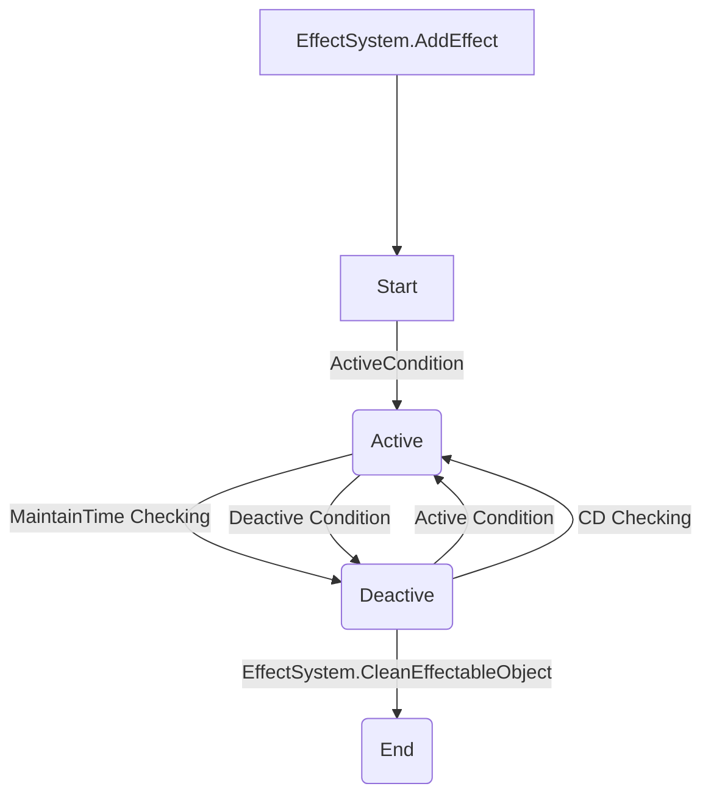

See [Document](https://macacagames.github.io/EffectSystem/) for more detail.

# Overview
Effect System is a powerful numerical calculator based on EffectType. It possesses high flexibility, maintainable states, the ability to implement custom logic, trigger conditions, and visual management. It can achieve the following example functionalities:

- Increase ATK by 50 points.
- Increase HP by 10%.
- Boost DEF by 5% for 50 seconds.
- Reduce the ATK of a specified enemy by 100, usable once every 30 seconds.
- When successfully blocking, decrease the opponent's DEF by 50%.

The table is used to collage various buffs, debuffs or skill effects based on EffectInfo as the basic unit, and it's convenient to use between different projects. Engineers only need to implement EffectType and register the timing of activation and deactivation.

---------
# Features
- Add or adjust skills through Excel
- Combine different skills through EffectSubInfo
---

# Installation
## Option 1: Install via OpenUPM (recommended)

```sh
openupm add com.macacagames.effectsystem
```

## Option 2: Unity Package file
Add to the editor's manifest.json:
```json
{
    "dependencies": {
        "com.macacagames.utility": "https://github.com/MacacaGames/MacacaUtility.git",
        "com.macacagames.effectsystem": "https://github.com/MacacaGames/EffectSystem.git"
    }
}
```

## Option 3: Git SubModule
```bash
git submodule add https://github.com/MacacaGames/EffectSystem.git Assets/MacacaEffectSystem
```
Note: EffectSystem is dependent on MacacaUtility, so MacacaUtility must also be added to the git submodule.
```bash
git submodule add https://github.com/MacacaGames/MacacaUtility.git Assets/MacacaUtility
```
---
# Resources

## SkillResource
    - AssetMenu path : _"GameResource/SkillResource"_
    - Add skill icon sprite
    - Paste the Json data of Enums backe into Bake All Effect Enum, and press Invoke
## EffectResource
    - AssetMenu path : _"GameResource/EffectResource"_
    - Paste EffectView Json
    - Add a path to store new special effects, then press the Get All View Prefab button
---

# Conecpt

## Life 


## EffectInfo
EffectInfo is the define of an effect, it only store the perference of an effect, but not handle the runtime behaviour.

One EffectInfo should only focus on one simple thing, such as calculating the ATK etc.
Sure! Here's a Markdown table based on the provided information:


| Field                   | Data Type    | Description                                                                                     |
|-------------------------|--------------|-------------------------------------------------------------------------------------------------|
| id                      | string       | The ID of an effect                                                                              |
| type                    | string       | The EffectType                                                                                   |
| activeCondition         | string       | The active trigger timing of condition                                                           |
| activeRequirementLists  | string[]     | The qualifications of an active trigger condition (user-defined)                                 |
| activeProbability       | float        | The probability (0-100) of the effect being activated                                            |
| deactiveCondition       | string       | The deactive trigger timing of condition                                                         |
| deactiveRequirementLists| string[]     | The qualifications of a deactive trigger condition                                               |
| deactiveProbability     | float        | The probability (0-100) of the effect being deactivated                                          |
| cooldownTime            | float        | The remaining time in seconds until the effect can be activated again                            |
| logic                   | enum         | Life cycle management preset logic                                                              |
| triggerTransType        | enum         | An enumeration to manage the logic when the effect tries to trigger twice                        |
| tags                    | string[]     | Pre-defined tags for an effect                                                                   |
| subInfoIds              | string[]     | Effect IDs of SubInfo. SubInfo is useful when there is a requirement to trigger another effect   |
| viewInfoIds             | string[]     | The View data IDs for an effect                                                                  |
| parameters              | key-value[]  | Custom parameters for your own project                                                          |


# Code Generate

## Pre Baked String for strong Type usage

The system use string as the ID to refer other resource, for more safety usage, it's recommend to use pre-baked string define for all your options. 

Here's the Table Example
[Effect Data Sample](https://docs.google.com/spreadsheets/d/1zYKiOlThAqTMVuUPHcxeQGX7rBRLp5E-49ci-GCZBa8/edit?usp=drive_link)
Add or remove the content of each field's Enum according to different needs and Use the **EffectSystemEditorWindow** to generate the Strings.


## MessagePack
The MessagePack.Csharp should do a code generate first to make the EffectInfo available to use on AOT Platform

First, use the mpc tool to generate the Resolver, here is some example: 
For more detail, see the MessagePack Document
```bash
dotnet new tool-manifest
dotnet tool install MessagePack.Generator
dotnet tool run mpc -i {PATH_TO_YOUR_EFFECTPACKAGE_MODEL_FOLEDR} -o ./Assets/EffectSystemResources/EffectSystem.Generated.cs -r EffectSystemResolver -n MacacaGames.EffectSystem

## Example
## dotnet tool run mpc -i ./MacacaPackages/EffectSystem/Model -o ./Assets/EffectSystemResources/EffectSystem.Generated.cs -r EffectSystemResolver -n MacacaGames.EffectSystem
```

And add into your StaticCompositeResolver
```csharp
StaticCompositeResolver.Instance.Register(
    MacacaGames.EffectSystem.Resolvers.EffectSystemResolver.Instance,
);
```
# Usage

## Implement EffectType
- Inheritance EffectBase and implement the required effects

## Inheritance and implement IEffectSystemData
- Initialize Effect table data
- Query EffectInfo
- Add all implemented EffectTypes to the dictionary

## Inheritance and implement IEffectableObject
- The entity used to add skills

## EffectSystem Component
- Attach Effect to IEffectableObject or remove it
- Query the Effect instance on IEffectableObject
- Get skill description with I2


# 1


## 1


## EffectDescription

